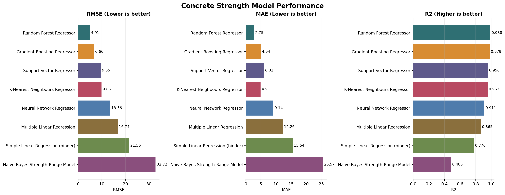
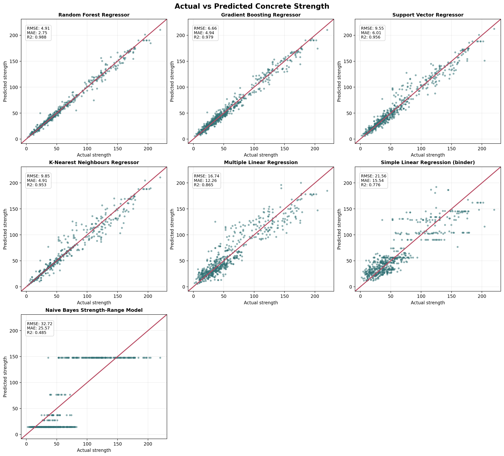
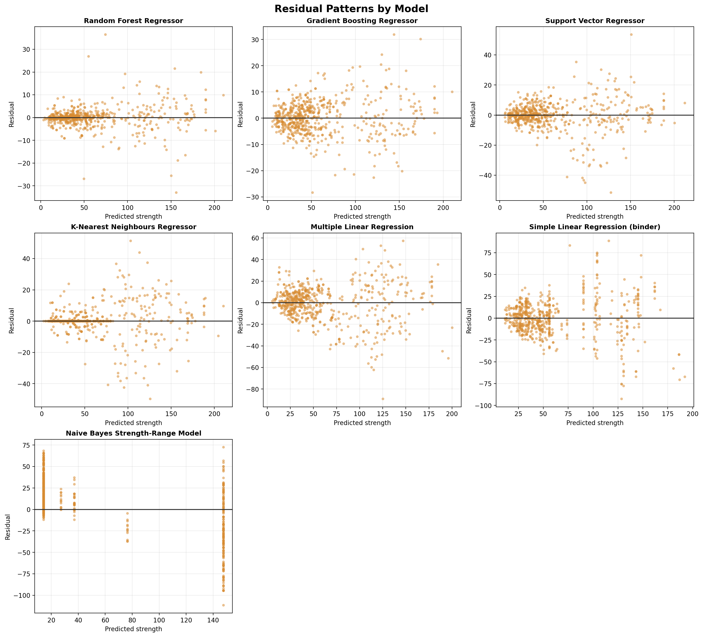
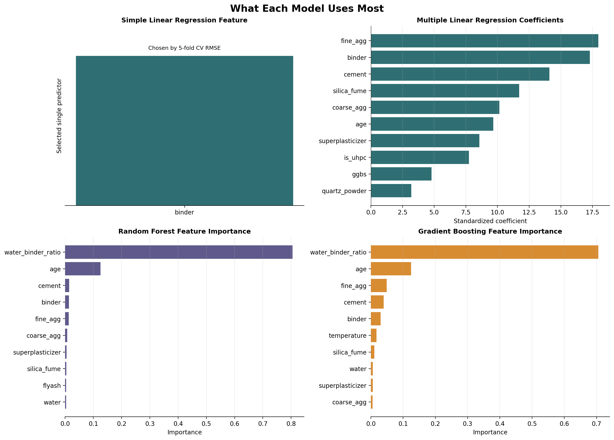

# Analysis of Concrete Strength Model Visualisations

This analysis explains how the four machine-learning models predict concrete compressive strength and interprets the visualisations generated from the model results.

The four models compared are:

- Simple Linear Regression
- Multiple Linear Regression
- Random Forest Regressor
- Gradient Boosting Regressor

The target variable is `cs`, which represents the measured concrete compressive strength. The models use concrete mix and curing variables such as cement, water, binder, water-binder ratio, aggregates, supplementary cementitious materials, superplasticizer, temperature, age, and whether the sample is UHPC.

## Overall Model Performance



The model performance graph compares the four models using RMSE, MAE, and R2.

RMSE, or Root Mean Squared Error, measures the average size of prediction errors. A lower RMSE means the predicted compressive strength values are closer to the actual measured values.

MAE, or Mean Absolute Error, also measures prediction error, but it gives the average absolute difference between actual and predicted strength. Like RMSE, a lower MAE is better.

R2 measures how much of the variation in compressive strength is explained by the model. An R2 value closer to 1 means the model explains more of the data and performs better.

From the graph, the Random Forest Regressor performs best overall. It has the lowest RMSE, the lowest MAE, and the highest R2 score.

The results are:

| Model | RMSE | MAE | R2 |
|---|---:|---:|---:|
| Random Forest Regressor | 4.91 | 2.75 | 0.988 |
| Gradient Boosting Regressor | 6.66 | 4.94 | 0.979 |
| Multiple Linear Regression | 16.74 | 12.26 | 0.865 |
| Simple Linear Regression | 21.56 | 15.54 | 0.776 |

This shows that the Random Forest Regressor gives the most accurate predictions of concrete compressive strength.

## Actual vs Predicted Concrete Strength



The actual vs predicted graphs show how close each model's predictions are to the real measured compressive strength values.

The diagonal line represents perfect prediction. If a point lies exactly on this line, the predicted concrete strength is equal to the actual concrete strength. Points close to the line indicate accurate predictions, while points far from the line indicate larger errors.

The Random Forest Regressor has the tightest grouping of points around the diagonal line. This means its predicted compressive strength values are very close to the actual values.

The Gradient Boosting Regressor also performs well, but its points are slightly more spread out than the Random Forest model.

The Multiple Linear Regression model has a wider spread of points. This suggests that although it can identify general trends, it is less accurate when predicting individual strength values.

The Simple Linear Regression model has the widest spread. This is because it only uses one predictor, binder, so it does not have enough information to fully explain concrete strength.

## Residual Analysis



Residuals are calculated as:

```text
Residual = Actual compressive strength - Predicted compressive strength
```

A good model should have residuals scattered closely around zero. This means the model is not consistently overpredicting or underpredicting the concrete strength.

The Random Forest Regressor has the smallest residual spread. This means its prediction errors are generally smaller than the other models.

The Gradient Boosting Regressor also has relatively small residuals, but they are slightly more spread out than the Random Forest model.

The Multiple Linear Regression and Simple Linear Regression models show much wider residual patterns. This indicates that these models miss some important relationships in the data.

Concrete compressive strength is affected by nonlinear relationships. For example, the effect of water-binder ratio depends on other mix components and curing age. Linear models struggle with these interactions because they assume a straight-line relationship between input variables and strength.

## Feature Importance and Model Behaviour



The feature summary graph shows which variables each model uses most when predicting compressive strength.

For the Simple Linear Regression model, the selected feature is binder. This means the model predicts strength using only the binder value. However, concrete strength depends on many other factors, so this model is too simple to be highly accurate.

For the Multiple Linear Regression model, the graph shows standardised coefficients. These coefficients indicate how strongly each feature contributes to the prediction. Positive coefficients increase predicted strength, while negative coefficients reduce predicted strength. This model is more useful than simple regression because it uses all features, but it is still limited because it assumes the relationship is linear.

For the Random Forest and Gradient Boosting models, the most important features include water-binder ratio and age. This makes sense because concrete strength is strongly affected by the amount of water relative to binder and by curing time.

A lower water-binder ratio usually leads to higher compressive strength because the concrete has less excess water and can form a denser hardened structure. Age is also important because concrete gains strength over time as hydration continues.

The tree-based models perform better because they can capture nonlinear behaviour and interactions between variables. For example, they can model how the effect of age changes depending on the water-binder ratio or cementitious material composition.

## How the Models Calculate Compressive Strength

The Simple Linear Regression model calculates compressive strength using one feature only. In this case, it uses binder. The model fits a straight-line equation:

```text
Predicted strength = intercept + coefficient x binder
```

This approach is easy to understand, but it is not accurate enough because concrete strength cannot be explained by binder alone.

The Multiple Linear Regression model calculates compressive strength using all input variables in one linear equation:

```text
Predicted strength = intercept + coefficient1 x feature1 + coefficient2 x feature2 + ...
```

This model considers more information than simple regression, but it still assumes that every feature has a straight-line effect on strength.

The Random Forest Regressor calculates compressive strength by building many decision trees. Each tree makes a prediction based on different splits in the data, such as water-binder ratio, age, cement content, or aggregate values. The final prediction is the average of all tree predictions. This averaging makes the model accurate and stable.

The Gradient Boosting Regressor also uses decision trees, but it builds them one after another. Each new tree tries to correct the errors made by the previous trees. This allows the model to improve gradually and capture complex patterns in the data.

## Final Conclusion

Based on the visualisations and the model metrics, the Random Forest Regressor is the best model for predicting concrete compressive strength.

It performs best because:

- It has the lowest RMSE, meaning it has the smallest overall prediction error.
- It has the lowest MAE, meaning its average prediction error is smallest.
- It has the highest R2 score, meaning it explains the most variation in concrete strength.
- Its actual vs predicted graph shows points closest to the perfect prediction line.
- Its residual plot shows the smallest and most balanced errors.
- It can model nonlinear relationships between mix design, curing age, and compressive strength.

The Gradient Boosting Regressor is the second-best model and also performs strongly. The Multiple Linear Regression model is useful for understanding feature effects, but it is less accurate. The Simple Linear Regression model performs worst because it only uses one feature and cannot represent the full complexity of concrete strength development.

Therefore, the recommended model is:

**Random Forest Regressor**
